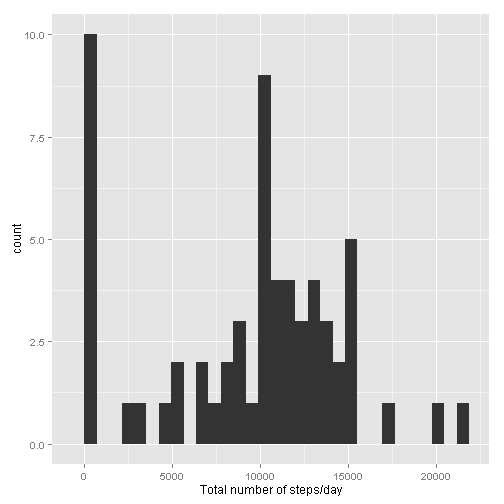

### Loading and preprocessing the data

1. Code needed to load the data


```r
# download.file("https://d396qusza40orc.cloudfront.net/repdata%2Fdata%2Factivity.zip", destfile = "repdata-data-activity.zip")

# unzip("repdata-data-activity.zip")

data <- read.csv("activity.csv", header = T, comment.char = "")
```

2. Code needed to transform the data

The date column needs to be transformed to Date class.


```r
data$date <- as.Date(data$date)
```


### What is the mean total number of steps taken in a day?

Missing values will be ignored for this part of the analysis.

1. The total number of steps taken in a day is calculated by grouping by the date and calculating the sum of the steps for each group. The dplyr library offers functions to group and summarize.


```r
library(dplyr)

steps <- group_by(data, date)

per_day <- summarize(steps, total.steps = sum(steps, na.rm = T))

summary(per_day)
```

```
##       date             total.steps   
##  Min.   :2012-10-01   Min.   :    0  
##  1st Qu.:2012-10-16   1st Qu.: 6778  
##  Median :2012-10-31   Median :10395  
##  Mean   :2012-10-31   Mean   : 9354  
##  3rd Qu.:2012-11-15   3rd Qu.:12811  
##  Max.   :2012-11-30   Max.   :21194
```

2. A histogram of the total number of steps taken per day is generated as shown.


```r
library(ggplot2)

qplot(per_day$total.steps, geom = "histogram", xlab = "Total number of steps/day")
```

 

3. The mean and median of the total number of steps taken per day are calculated as follows.


```r
mean_steps <- mean(per_day$total.steps, na.rm = T)
median_steps <- median(per_day$total.steps, na.rm = T)
```

The mean is 9354.2295082 and the median is 10395.

### What is the average daily activity pattern?

1. A time series plot of the 5-minute interval and the average number of steps


```r
library(ggplot2)

mean_steps_per_interval <- aggregate(data$steps, by = list(data$interval), FUN = mean, na.rm = T)

colnames(mean_steps_per_interval) <- c("interval", "mean.steps")

qplot(data = mean_steps_per_interval, x = interval, y = mean.steps, geom = "line", main = "Average number of steps over 5-min intervals")
```

 

2. To find the interval with the maximum activity, we first find the maximum value and then select the interval corresponding to it.


```r
max_val <- max(mean_steps_per_interval$mean.steps, na.rm = T)
max_interval <- mean_steps_per_interval[which(mean_steps_per_interval$mean.steps == max_val),]$interval
```

The interval with the maximum number of steps (on average) is 835.

### Imputing missing values

1. The number of missing values is computed by using the is.na function.


```r
num_missing <- sum(is.na(data$steps))
```

The number of missing values is 2304.

2. The missing values are replaced with the mean of the steps.

First, a function is defined to calculate the missing value as the mean of the steps if missing.


```r
impute_missing <- function(x) {
        ifelse(is.na(x), mean(data$steps, na.rm = T), x)
}
```

Next, the missing values are calculated by using sapply and then assigning the column to the data frame.


```r
completes <- sapply(data$steps, FUN = impute_missing)
```

3. A new data frame is created with the missing values filled in as follows.


```r
data <- data.frame(steps = completes, date = data$date, interval = data$interval)

numrows <- nrow(data)

nummissing <- sum(complete.cases(data))
```

The data frame now contains 17568 rows and the number of complete cases is 17568.

4. A histogram of the total number of steps taken per day.


```r
complete_steps_by_date <- aggregate(steps ~ date, data, sum)

library(ggplot2)

qplot(complete_steps_by_date$steps, geom = "histogram", xlab = "Total number of steps/day")
```

 

```r
c_mean_steps <- mean(complete_steps_by_date$steps)

c_median_steps <- median(complete_steps_by_date$steps)
```

After imputing missing values, the mean number of steps is 1.0766189 &times; 10<sup>4</sup> and the median number of steps is 1.0766189 &times; 10<sup>4</sup>. The previous mean and median were 9354.2295082 and 10395.

### Are there differences in activity patterns between weekdays and weekends?

1. A new column is added to the data to indcate if it is a weekend or weekday.


```r
weekend <- function(x) {
        ifelse(weekdays(x) %in% c("Sunday","Saturday"),
               "weekend",
               "weekday")
}
# categorize as weekday or weekend
w <- sapply(data$date, FUN = weekend)

# add column
data$day.type <- w

# split into weekday and weekend data
cwd <- data[which(data$day.type=="weekday"),]
cwe <- data[which(data$day.type=="weekend"),]

# aggregate by interval in each data set
cwdm <- aggregate(cwd$steps, by = list(cwd$interval), FUN = mean, na.rm = T)
cwem <- aggregate(cwe$steps, by = list(cwe$interval), FUN = mean, na.rm = T)

cwdm$day.type <- c("weekday")
cwem$day.type <- c("weekend")

cw <- rbind(cwdm, cwem)
names(cw) <- c("interval", "mean.steps", "day.type")

qplot(data = cw, x = interval, y = mean.steps, geom = "line", facets = day.type ~ ., main = "Average number of steps")
```

 
